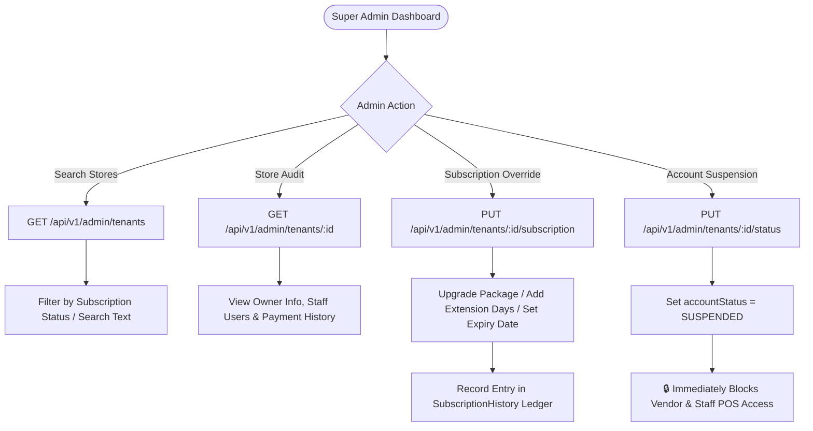

# 👑 Super Admin Tenant Management Module Backend Documentation
**Multi-Tenant Billing SaaS Backend**  
*Version: 1.0.0*

---

## 📋 Table of Contents
1. [Overview & Core Architecture](#overview--core-architecture)
2. [Database Schema & Models](#database-schema--models)
3. [API Endpoints Reference](#api-endpoints-reference)
4. [Super Admin Administration Workflows](#super-admin-administration-workflows)
5. [Validation Schemas & Rules](#validation-schemas--rules)
6. [API Request & Response Specification](#api-request--response-specification)
7. [Security & Account Lock Enforcement](#security--account-lock-enforcement)

---

## 1. Overview & Core Architecture

The **Super Admin Tenant Management Module** (located inside `src/modules/admin/tenant`) empowers SaaS Platform Admins (`SUPER_ADMIN`) to monitor, manage, audit, and control all tenant store accounts operating on the platform.

### Key Capabilities:
- **Global Platform Monitoring**: View and search all registered vendor stores across the entire SaaS platform.
- **Subscription Overrides**: Manually upgrade vendor subscription packages, extend trial periods by specified days, or override `subscriptionExpiryDate`.
- **Instant Workspace Suspension / Reactivation**: Toggle tenant store `accountStatus` between `ACTIVE` and `SUSPENDED`. Suspended stores and all associated staff accounts are immediately blocked from logging in or executing POS transactions.
- **Deep Tenant Audit Details**: Fetch complete store information including business profile, owner contact info, linked users/employees, product counts, bill counts, and full `SubscriptionHistory` ledger.

---

## 2. Database Schema & Models

Primary database models in `prisma/schema.prisma`:

```prisma
enum AccountStatus {
  ACTIVE
  SUSPENDED
}

enum SubscriptionStatus {
  FREE_TRIAL
  FREE_TRIAL_ENDED
  UPGRADED
  EXPIRED
}

model Tenant {
  id                     String             @id @default(uuid())
  businessName           String?
  businessType           String?
  ownerName              String
  email                  String?            @unique
  mobileNumber           String             @unique
  businessLogo           String?
  businessAddress        String?
  city                   String?
  state                  String?
  country                String?            @default("India")
  pincode                String?
  gstNumber              String?
  panNumber              String?
  otherInvoiceInfo       String?
  isProfileComplete      Boolean            @default(false)
  
  subscriptionStatus     SubscriptionStatus @default(FREE_TRIAL)
  accountStatus          AccountStatus      @default(ACTIVE)
  
  currentPackageId       String?
  currentPackage         Package?           @relation(fields: [currentPackageId], references: [id])
  subscriptionStartDate  DateTime           @default(now())
  subscriptionExpiryDate DateTime
  
  users                  User[]
  products               Product[]
  customers              Customer[]
  bills                  Bill[]
  taxes                  Tax[]
  employees              EmployeeProfile[]
  suppliers              Supplier[]
  supplierPayments       SupplierPayment[]
  purchaseInvoices       PurchaseInvoice[]
  subscriptionHistory    SubscriptionHistory[]

  createdAt              DateTime           @default(now())
  updatedAt              DateTime           @updatedAt
}

model SubscriptionHistory {
  id             String        @id @default(uuid())
  tenantId       String
  tenant         Tenant        @relation(fields: [tenantId], references: [id], onDelete: Cascade)
  
  packageId      String
  package        Package       @relation(fields: [packageId], references: [id])
  
  amount         Float
  paymentMethod  PaymentMethod @default(CARD)
  paymentStatus  String        // SUCCESS, FAILED, PENDING
  transactionId  String?
  startDate      DateTime
  expiryDate     DateTime

  createdAt      DateTime      @default(now())
}
```

---

## 3. API Endpoints Reference

All endpoints are mounted under `/api/v1/admin/tenants` and require Super Admin Authorization (`authenticateToken` + `SUPER_ADMIN` role).

| Method | Endpoint Path | Action / Purpose |
| :--- | :--- | :--- |
| `GET` | `/api/v1/admin/tenants` | List & Search All Registered Tenant Store Workspaces |
| `GET` | `/api/v1/admin/tenants/:id` | Get Complete Store Profile, Linked Users & Subscription Ledger |
| `PUT` | `/api/v1/admin/tenants/:id/subscription` | Super Admin Package Upgrade & Subscription Extension |
| `PUT` | `/api/v1/admin/tenants/:id/status` | Suspend or Reactivate Tenant Store Workspace |

---

## 4. Super Admin Administration Workflows



---

## 5. Validation Schemas & Rules

Defined in `src/modules/admin/tenant/tenant.validator.js`:

- `updateTenantSubscriptionSchema`:
  - `packageId`: Optional valid UUID.
  - `extensionDays`: Optional positive integer or numeric string (e.g. `30` days).
  - `subscriptionStatus`: Enum `['FREE_TRIAL', 'FREE_TRIAL_ENDED', 'UPGRADED', 'EXPIRED']`.
  - `newExpiryDate`: Optional ISO Date string.
- `updateTenantStatusSchema`:
  - `accountStatus`: Required Enum `['ACTIVE', 'SUSPENDED']`.

---

## 6. API Request & Response Specification

### 6.1 List & Search Platform Tenant Stores
- **Endpoint:** `GET /api/v1/admin/tenants?status=FREE_TRIAL&search=Gupta`
- **Response (200 OK):**
```json
{
  "statusCode": 200,
  "data": [
    {
      "id": "t-uuid-201",
      "businessName": "Gupta Hardware & Electronics",
      "ownerName": "Ramesh Gupta",
      "email": "ramesh@guptahardware.com",
      "mobileNumber": "9876543210",
      "registrationDate": "2026-08-01T09:00:00.000Z",
      "currentPackage": {
        "id": "pkg-1",
        "packageName": "Pro Retail Plan",
        "amount": 999
      },
      "subscriptionStartDate": "2026-08-01T09:00:00.000Z",
      "subscriptionExpiryDate": "2026-08-31T09:00:00.000Z",
      "subscriptionStatus": "FREE_TRIAL",
      "accountStatus": "ACTIVE",
      "isProfileComplete": true,
      "counts": {
        "employees": 3,
        "products": 95,
        "bills": 342,
        "customers": 128
      }
    }
  ],
  "message": "Tenants list fetched successfully."
}
```

---

### 6.2 Get Complete Tenant Audit Details
- **Endpoint:** `GET /api/v1/admin/tenants/t-uuid-201`
- **Response (200 OK):**
```json
{
  "statusCode": 200,
  "data": {
    "id": "t-uuid-201",
    "businessInformation": {
      "businessName": "Gupta Hardware & Electronics",
      "businessType": "Retail Hardware Store",
      "gstNumber": "09AAAAA0000A1Z5",
      "panNumber": "ABCDE1234F",
      "city": "Noida",
      "state": "Uttar Pradesh"
    },
    "ownerInformation": {
      "ownerName": "Ramesh Gupta",
      "email": "ramesh@guptahardware.com",
      "mobileNumber": "9876543210"
    },
    "currentPackage": {
      "packageName": "Pro Retail Plan",
      "amount": 999
    },
    "subscriptionDetails": {
      "subscriptionStatus": "FREE_TRIAL",
      "subscriptionStartDate": "2026-08-01T09:00:00.000Z",
      "subscriptionExpiryDate": "2026-08-31T09:00:00.000Z"
    },
    "accountStatus": "ACTIVE",
    "users": [
      {
        "id": "u-101",
        "name": "Ramesh Gupta",
        "mobileNumber": "9876543210",
        "role": "TENANT_ADMIN",
        "status": "ACTIVE"
      },
      {
        "id": "u-102",
        "name": "Counter Staff 1",
        "mobileNumber": "9870001111",
        "role": "EMPLOYEE",
        "status": "ACTIVE"
      }
    ],
    "paymentHistory": [
      {
        "id": "sub-hist-1",
        "amount": 0,
        "paymentMethod": "OTHER",
        "paymentStatus": "SUCCESS",
        "startDate": "2026-08-01T09:00:00.000Z",
        "expiryDate": "2026-08-31T09:00:00.000Z"
      }
    ]
  },
  "message": "Tenant details fetched successfully."
}
```

---

### 6.3 Update / Extend Tenant Subscription
- **Endpoint:** `PUT /api/v1/admin/tenants/t-uuid-201/subscription`
- **Request Body:**
```json
{
  "packageId": "pkg-pro-uuid",
  "extensionDays": 30,
  "subscriptionStatus": "UPGRADED",
  "amount": 999,
  "paymentMethod": "UPI",
  "transactionId": "ADMIN_MANUAL_PAY_998811"
}
```
- **Response (200 OK):**
```json
{
  "statusCode": 200,
  "data": {
    "id": "t-uuid-201",
    "subscriptionStatus": "UPGRADED",
    "subscriptionExpiryDate": "2026-09-30T09:00:00.000Z",
    "currentPackage": {
      "packageName": "Pro Retail Plan",
      "amount": 999
    }
  },
  "message": "Tenant subscription updated successfully."
}
```

---

### 6.4 Suspend or Reactivate Tenant Store Workspace
- **Endpoint:** `PUT /api/v1/admin/tenants/t-uuid-201/status`
- **Request Body:**
```json
{
  "accountStatus": "SUSPENDED"
}
```
- **Response (200 OK):**
```json
{
  "statusCode": 200,
  "data": {
    "id": "t-uuid-201",
    "accountStatus": "SUSPENDED"
  },
  "message": "Tenant account status updated to SUSPENDED."
}
```

---

## 7. Security & Account Lock Enforcement

When a Super Admin sets `accountStatus = SUSPENDED`:
1. The `Tenant` table record is updated to `SUSPENDED`.
2. Any subsequent authentication attempt or API request by the store owner (`TENANT_ADMIN`) or any staff member (`EMPLOYEE`) attached to that `tenantId` is immediately rejected by authentication middlewares (`auth.middleware.js`) with `403 Forbidden`:
   ```json
   {
     "statusCode": 403,
     "message": "Account suspended. Store workspace has been suspended by SaaS Admin."
   }
   ```
