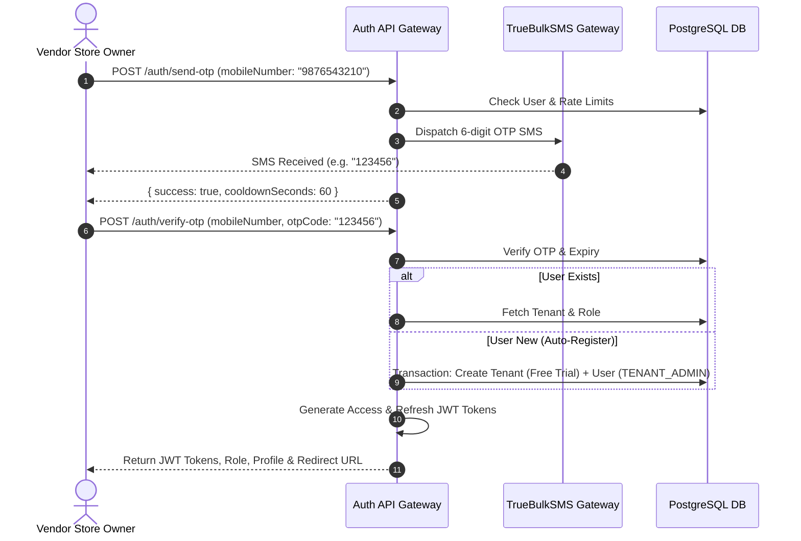

# 🔐 Authentication & Access Control Module Backend Documentation
**Multi-Tenant Billing SaaS Backend**  
*Version: 1.0.0*

---

## 📋 Table of Contents
1. [Overview & Core Architecture](#overview--core-architecture)
2. [Database Schema & Models](#database-schema--models)
3. [API Endpoints Reference](#api-endpoints-reference)
4. [Authentication Workflows & Lifecycle](#authentication-workflows--lifecycle)
5. [Token Security & Access Control](#token-security--access-control)
6. [Validation Schemas & Rules](#validation-schemas--rules)
7. [API Request & Response Specification](#api-request--response-specification)
8. [Role-Based Access Control (RBAC) Matrix](#role-based-access-control-rbac-matrix)

---

## 1. Overview & Core Architecture

The **Authentication & Access Control Module** handles identity management, multi-tenant workspace onboarding, and security for three distinct user roles:

1. **Vendors / Store Owners (`TENANT_ADMIN`)**: Authenticate via 10-digit Indian Mobile Number and SMS OTP. Auto-registers new vendor store workspaces with a 30-day Free Trial.
2. **Counter Staff / Employees (`EMPLOYEE`)**: Created by store owners. Authenticate via Mobile Number + OTP or Password linked to their parent store workspace.
3. **SaaS Platform Super Admins (`SUPER_ADMIN`)**: Authenticate via Email + Password (+ optional 2FA OTP) to manage platform tenants, SaaS packages, global tax slabs, and global categories.

### Key Features:
- **SMS Gateway Integration**: TrueBulkSMS SMS service integration with local console fallback for local development.
- **OTP Rate-Limiting & Security**: 6-digit OTP codes, 5-minute expiration, 60-second resend cooldown, and 5-attempt brute-force lockout.
- **JWT Dual-Token Security**: Short-lived Access Tokens (JWT) + Long-lived Refresh Tokens (`7d`), with server-side `tokenBlacklist` service for instant logout revocation.
- **Subscription Expiry & Soft Locks**: Automatically checks store subscription status and flags expired tenants with read-only access locks.

---

## 2. Database Schema & Models

Extends core identity models in `prisma/schema.prisma`:

```prisma
enum UserRole {
  SUPER_ADMIN
  TENANT_ADMIN
  EMPLOYEE
}

enum SubscriptionStatus {
  FREE_TRIAL
  FREE_TRIAL_ENDED
  UPGRADED
  EXPIRED
}

enum AccountStatus {
  ACTIVE
  SUSPENDED
}

model User {
  id                   String            @id @default(uuid())
  name                 String
  email                String?           @unique
  mobileNumber         String            @unique
  passwordHash         String
  role                 UserRole          @default(EMPLOYEE)
  status               AccountStatus     @default(ACTIVE)
  
  tenantId             String?
  tenant               Tenant?           @relation(fields: [tenantId], references: [id], onDelete: Cascade)
  
  employeeProfile      EmployeeProfile?
  createdAt            DateTime          @default(now())
  updatedAt            DateTime          @updatedAt
}

model OTPVerification {
  id           String    @id @default(uuid())
  mobileNumber String    @unique
  otpCode      String
  expiresAt    DateTime
  isVerified   Boolean   @default(false)
  attempts     Int       @default(0)
  lockedUntil  DateTime?
  lastSentAt   DateTime  @default(now())
  metadata     Json?
  createdAt    DateTime  @default(now())
  updatedAt    DateTime  @updatedAt
}
```

---

## 3. API Endpoints Reference

Mounted under `/api/v1/auth`:

### 3.1 Public Auth Routes
| Method | Endpoint Path | Action / Purpose |
| :--- | :--- | :--- |
| `POST` | `/api/v1/auth/send-otp` | Request 6-Digit OTP SMS to Mobile Number |
| `POST` | `/api/v1/auth/verify-otp` | Verify OTP, Auto-Register new vendor, or Login existing user |
| `POST` | `/api/v1/auth/resend-otp` | Resend fresh OTP SMS (60s cooldown enforced) |
| `POST` | `/api/v1/auth/refresh-token` | Refresh Access Token using valid Refresh Token |
| `POST` | `/api/v1/auth/admin/login` | Email + Password Login for Super Admin |

### 3.2 Protected Auth Routes (Require Bearer Token)
| Method | Endpoint Path | Access Role | Action / Purpose |
| :--- | :--- | :--- | :--- |
| `GET` | `/api/v1/auth/me` | All Authenticated | Get current authenticated user profile & tenant summary |
| `POST` | `/api/v1/auth/logout` | All Authenticated | Revoke tokens & logout |
| `POST` | `/api/v1/auth/employee/register` | `TENANT_ADMIN` | Register new Counter Staff / Employee |

---

## 4. Authentication Workflows & Lifecycle

### Vendor Registration & Login Flow (Phone OTP)



---

## 5. Token Security & Access Control

### 5.1 Token Payload Structure
- **Access Token**: Expires in 7 days (or configured `JWT_EXPIRES_IN`). Contains `userId`, `role`, `userRoleEnum`, `tenantId`, `isSubscriptionExpired`, `isReadOnly`.
- **Refresh Token**: Expires in 30 days. Used strictly with `/auth/refresh-token` to acquire new access tokens.

### 5.2 Server-Side Token Blacklisting
When `/auth/logout` is called:
1. The Access Token and Refresh Token are added to the in-memory `tokenBlacklist` service.
2. The authentication middleware `auth.middleware.js` rejects any future requests bearing blacklisted tokens with `401 Unauthorized`.

---

## 6. Validation Schemas & Rules

Defined in `src/modules/auth/auth.validator.js`:

- `sendOTPSchema`: `mobileNumber` required (10-digit Indian format starting 6-9).
- `verifyOTPSchema`: `mobileNumber` (10 digits) + `otp` / `otpCode` (6-digit numeric string).
- `adminLoginSchema`: `email` (valid email) + `password` (minimum 6 chars).
- `registerEmployeeSchema`: `name`, `mobileNumber`, `password` (minimum 6 chars).

---

## 7. API Request & Response Specification

### 7.1 Request OTP SMS
- **Endpoint:** `POST /api/v1/auth/send-otp`
- **Request Body:**
```json
{
  "mobileNumber": "9876543210"
}
```
- **Response (200 OK):**
```json
{
  "statusCode": 200,
  "data": {
    "success": true,
    "message": "OTP sent successfully to mobile number.",
    "mobileNumber": "9876543210",
    "isExistingUser": true,
    "role": "vendor",
    "cooldownSeconds": 60
  },
  "message": "Login OTP sent successfully via SMS."
}
```

---

### 7.2 Verify OTP & Login
- **Endpoint:** `POST /api/v1/auth/verify-otp`
- **Request Body:**
```json
{
  "mobileNumber": "9876543210",
  "otp": "123456"
}
```
- **Response (200 OK):**
```json
{
  "statusCode": 200,
  "data": {
    "success": true,
    "message": "Mobile OTP verified. Login granted.",
    "accessToken": "eyJhbGciOiJIUzI1NiIsInR5cCI6IkpXVCJ9...",
    "refreshToken": "eyJhbGciOiJIUzI1NiIsInR5cCI6IkpXVCJ9...",
    "role": "vendor",
    "user": {
      "id": "u-uuid-101",
      "name": "Ramesh Gupta",
      "mobileNumber": "9876543210",
      "role": "TENANT_ADMIN"
    },
    "tenant": {
      "id": "t-uuid-201",
      "businessName": "Gupta Hardware & Electronics",
      "subscriptionStatus": "FREE_TRIAL",
      "accountStatus": "ACTIVE"
    },
    "redirectUrl": "/vendor/dashboard"
  },
  "message": "OTP verified successfully. Login granted."
}
```

---

### 7.3 Super Admin Password Login
- **Endpoint:** `POST /api/v1/auth/admin/login`
- **Request Body:**
```json
{
  "email": "admin@softfyr.com",
  "password": "AdminPassword123"
}
```
- **Response (200 OK):**
```json
{
  "statusCode": 200,
  "data": {
    "success": true,
    "accessToken": "eyJhbGciOiJIUzI1...",
    "role": "admin",
    "redirectUrl": "/admin/dashboard"
  },
  "message": "Admin credentials verified. Login granted."
}
```

---

## 8. Role-Based Access Control (RBAC) Matrix

| Permission / Feature Area | `SUPER_ADMIN` | `TENANT_ADMIN` (Vendor) | `EMPLOYEE` (Staff) |
| :--- | :---: | :---: | :---: |
| Platform Dashboard & Tenant Management | ✅ Full Access | ❌ Blocked | ❌ Blocked |
| Store Setup, Taxes & Package Upgrade | ❌ Blocked | ✅ Full Access | ❌ Blocked |
| Register & Manage Counter Staff | ❌ Blocked | ✅ Full Access | ❌ Blocked |
| Product Catalog & Categories | Read Only | ✅ Full Access | Read Only |
| Inventory Stock Adjustments | Read Only | ✅ Full Access | Restricted |
| Create Purchase Bills & Payments | ❌ Blocked | ✅ Full Access | ❌ Blocked |
| POS Checkout & Bill Invoicing | ❌ Blocked | ✅ Full Access | ✅ Full Access |
