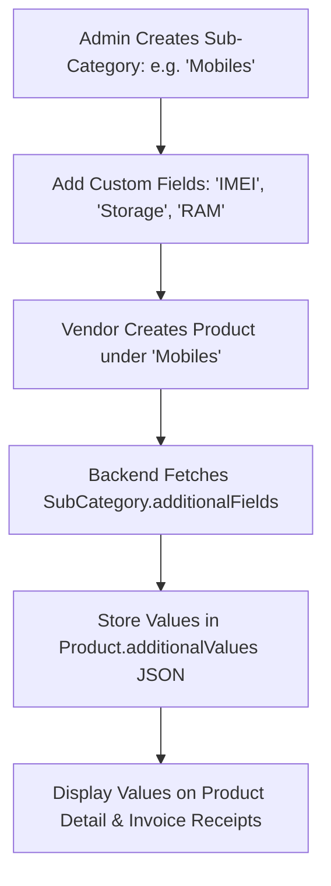

# 🏷️ Category & Dynamic Fields Module Backend Documentation
**Multi-Tenant Billing SaaS Backend**  
*Version: 1.0.0*

---

## 📋 Table of Contents
1. [Overview & Core Architecture](#overview--core-architecture)
2. [Database Schema & Models](#database-schema--models)
3. [API Endpoints Reference](#api-endpoints-reference)
4. [Dynamic Additional Fields Engine](#dynamic-additional-fields-engine)
5. [Validation Schemas & Input Types](#validation-schemas--input-types)
6. [API Request & Response Specification](#api-request--response-specification)
7. [Integration with Product Catalog](#integration-with-product-catalog)

---

## 1. Overview & Core Architecture

The **Category Module** provides a flexible 3-tier catalog hierarchy for products in the SaaS platform:

1. **Master Categories** (e.g. *Electronics*, *Groceries*, *Apparel*): Top-level product groupings.
2. **Sub-Categories** (e.g. *Mobiles*, *Packaged Snacks*, *Footwear*): Detailed product categories linked to a Master Category, with configurable feature toggles (e.g. `enableExpiryDate`).
3. **Dynamic Additional Fields Builder**: Allows store owners/admins to define custom key-value attributes (e.g. *IMEI Number*, *Batch Number*, *Warranty Period*, *Color*, *Size*) per Sub-Category. Products created under that Sub-Category dynamically accept and validate these custom fields.

---

## 2. Database Schema & Models

Defines three relational models in `prisma/schema.prisma`:

```prisma
enum InputType {
  TEXT
  NUMBER
  DATE
  DROPDOWN
  BOOLEAN
}

model Category {
  id            String        @id @default(uuid())
  name          String        @unique
  description   String?
  
  subCategories SubCategory[]
  products      Product[]

  createdAt     DateTime      @default(now())
  updatedAt     DateTime      @updatedAt
}

model SubCategory {
  id               String            @id @default(uuid())
  categoryId       String
  category         Category          @relation(fields: [categoryId], references: [id], onDelete: Cascade)
  
  name             String
  description      String?
  enableExpiryDate Boolean           @default(false)

  additionalFields AdditionalField[]
  products         Product[]

  createdAt        DateTime          @default(now())
  updatedAt        DateTime          @updatedAt

  @@unique([categoryId, name])
}

model AdditionalField {
  id            String        @id @default(uuid())
  subCategoryId String
  subCategory   SubCategory   @relation(fields: [subCategoryId], references: [id], onDelete: Cascade)
  
  labelName     String
  inputType     InputType     @default(TEXT)
  isRequired    Boolean       @default(false)
  status        AccountStatus @default(ACTIVE)

  createdAt     DateTime      @default(now())
  updatedAt     DateTime      @updatedAt
}
```

---

## 3. API Endpoints Reference

Mounted under `/api/v1/admin` (or global admin routes) requiring JWT Bearer Authentication (`authenticateToken`).

### 3.1 Master Category Endpoints
| Method | Endpoint Path | Action / Purpose |
| :--- | :--- | :--- |
| `POST` | `/api/v1/admin/categories` | Create Master Category |
| `GET` | `/api/v1/admin/categories` | List All Categories with Sub-Categories & Product counts |
| `GET` | `/api/v1/admin/categories/:id` | Get Category Details by ID |
| `PUT` | `/api/v1/admin/categories/:id` | Update Master Category Name & Description |
| `DELETE` | `/api/v1/admin/categories/:id` | Delete Master Category (Cascade deletes sub-categories) |

### 3.2 Sub-Category Endpoints
| Method | Endpoint Path | Action / Purpose |
| :--- | :--- | :--- |
| `POST` | `/api/v1/admin/sub-categories` | Create Sub-Category with optional Dynamic Fields |
| `GET` | `/api/v1/admin/sub-categories` | List Sub-Categories (optional filter `?categoryId=id`) |
| `GET` | `/api/v1/admin/sub-categories/:id` | Get Sub-Category Details by ID |
| `PUT` | `/api/v1/admin/sub-categories/:id` | Update Sub-Category Name, Description, or Expiry Toggle |
| `DELETE` | `/api/v1/admin/sub-categories/:id` | Delete Sub-Category |

### 3.3 Dynamic Additional Fields Endpoints
| Method | Endpoint Path | Action / Purpose |
| :--- | :--- | :--- |
| `POST` | `/api/v1/admin/sub-categories/:subCategoryId/fields` | Add Dynamic Custom Field to Sub-Category |
| `PUT` | `/api/v1/admin/sub-categories/fields/:fieldId` | Update Custom Field Configuration |
| `DELETE` | `/api/v1/admin/sub-categories/fields/:fieldId` | Delete Dynamic Field Configuration |

---

## 4. Dynamic Additional Fields Engine

### How Dynamic Fields Work with Product Creation:


1. **Schema Definition**: Additional fields are configured on a `SubCategory` with `labelName`, `inputType` (`TEXT`, `NUMBER`, `DATE`, `DROPDOWN`, `BOOLEAN`), and `isRequired`.
2. **Product Storage**: Products created in this Sub-Category store dynamic field values inside the `Product.additionalValues` JSON column:
   ```json
   {
     "IMEI Number": "864291048201948",
     "RAM": "8GB",
     "Storage": "128GB"
   }
   ```

---

## 5. Validation Schemas & Input Types

Defined in `src/modules/admin/category/category.validator.js`:

- **Master Category**: `name` must be at least 2 characters. Case-insensitive unique check per tenant.
- **Sub-Category**: `categoryId` required, `name` unique per parent category.
- **Input Types Enum**:
  - `TEXT`: Generic string inputs.
  - `NUMBER`: Numeric attributes (e.g. Wattage, Voltage).
  - `DATE`: Date pickers (e.g. Manufacturing Date).
  - `DROPDOWN`: Pre-configured option pickers.
  - `BOOLEAN`: Yes/No toggles (e.g. Fragile, Is Fragrance Free).

---

## 6. API Request & Response Specification

### 6.1 Create Master Category
- **Endpoint:** `POST /api/v1/admin/categories`
- **Request Body:**
```json
{
  "name": "Electronics & Gadgets",
  "description": "Smartphones, Laptops, Accessories, and Peripherals"
}
```
- **Response (201 Created):**
```json
{
  "statusCode": 201,
  "data": {
    "id": "cat-uuid-101",
    "name": "Electronics & Gadgets",
    "description": "Smartphones, Laptops, Accessories, and Peripherals",
    "createdAt": "2026-08-22T16:40:00.000Z"
  },
  "message": "Category created successfully."
}
```

---

### 6.2 Create Sub-Category with Dynamic Custom Fields
- **Endpoint:** `POST /api/v1/admin/sub-categories`
- **Request Body:**
```json
{
  "categoryId": "cat-uuid-101",
  "name": "Smartphones",
  "description": "Mobile phones and tablets",
  "enableExpiryDate": false,
  "additionalFields": [
    {
      "labelName": "IMEI 1",
      "inputType": "TEXT",
      "isRequired": true
    },
    {
      "labelName": "RAM",
      "inputType": "TEXT",
      "isRequired": false
    },
    {
      "labelName": "Warranty Months",
      "inputType": "NUMBER",
      "isRequired": false
    }
  ]
}
```
- **Response (201 Created):**
```json
{
  "statusCode": 201,
  "data": {
    "id": "subcat-uuid-201",
    "categoryId": "cat-uuid-101",
    "name": "Smartphones",
    "enableExpiryDate": false,
    "additionalFields": [
      {
        "id": "f-1",
        "labelName": "IMEI 1",
        "inputType": "TEXT",
        "isRequired": true,
        "status": "ACTIVE"
      },
      {
        "id": "f-2",
        "labelName": "RAM",
        "inputType": "TEXT",
        "isRequired": false,
        "status": "ACTIVE"
      }
    ]
  },
  "message": "Sub-category created successfully with custom fields."
}
```

---

### 6.3 Add Additional Dynamic Field
- **Endpoint:** `POST /api/v1/admin/sub-categories/:subCategoryId/fields`
- **Request Body:**
```json
{
  "labelName": "Battery Health %",
  "inputType": "NUMBER",
  "isRequired": false,
  "status": "ACTIVE"
}
```
- **Response (201 Created):**
```json
{
  "statusCode": 201,
  "data": {
    "id": "f-3",
    "subCategoryId": "subcat-uuid-201",
    "labelName": "Battery Health %",
    "inputType": "NUMBER",
    "isRequired": false,
    "status": "ACTIVE"
  },
  "message": "Additional field added successfully."
}
```

---

### 6.4 List Categories with Sub-Categories & Product Counts
- **Endpoint:** `GET /api/v1/admin/categories?search=Elect`
- **Response (200 OK):**
```json
{
  "statusCode": 200,
  "data": [
    {
      "id": "cat-uuid-101",
      "name": "Electronics & Gadgets",
      "description": "Smartphones, Laptops, Accessories, and Peripherals",
      "_count": {
        "products": 42
      },
      "subCategories": [
        {
          "id": "subcat-uuid-201",
          "name": "Smartphones",
          "enableExpiryDate": false,
          "additionalFields": [
            {
              "id": "f-1",
              "labelName": "IMEI 1",
              "inputType": "TEXT",
              "isRequired": true
            }
          ]
        }
      ]
    }
  ],
  "message": "Categories list fetched successfully."
}
```

---

## 7. Integration with Product Catalog

When creating or editing products via `POST /api/v1/products`:

1. The frontend queries `GET /api/v1/admin/sub-categories/:id` to retrieve configured `additionalFields` and `enableExpiryDate` flag.
2. If `enableExpiryDate` is `true`, the product form displays mandatory expiry date pickers.
3. The product creation payload sends dynamic field values inside `additionalValues`.
4. POS Billing & Invoicing endpoints include `additionalValues` on thermal and PDF receipt generation.
